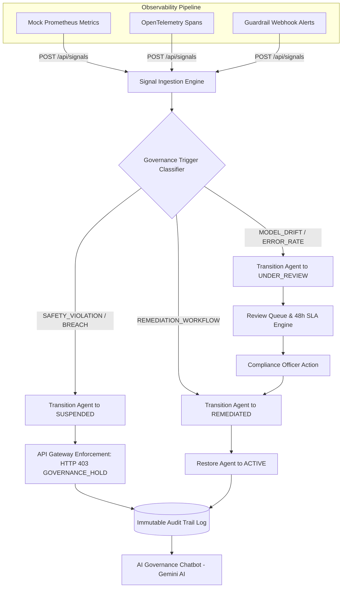

# 🛡️ AI Governance Control Center (AI-GCC)

[](https://reactjs.org/)
[](https://vitejs.dev/)
[](https://tailwindcss.com/)
[](https://nodejs.org/)
[](https://expressjs.com/)
[](https://www.mongodb.com/)
[](https://aistudio.google.com/)
[](LICENSE)

> **Enterprise AI Observability-to-Governance Pipeline**: Connecting production AI monitoring signals directly to automated governance workflows, deterministic state machine enforcement, API Gateway locks (`HTTP 403 GOVERNANCE_HOLD`), and auditable compliance logs.

---

## 📌 Problem Statement & Context

### The Observability Gap
In standard enterprise AI engineering setups, when a production anomaly fires (such as model concept drift, prompt injection, or severe hallucination), standard APM tools merely drop an alert into a developer Slack channel. 

An engineer might see it; they might not. The compliance team never hears about it, while the official governance dashboard remains green. Weeks later during an audit, it is discovered that an AI model was operating outside its documented performance envelope for 22 days without compliance oversight.

### The Challenge
Build an automated governance pipeline that connects observability signals directly to governance actions — ensuring that production anomalies automatically trigger compliance workflows, state transitions, and API gateway enforcement, rather than relying solely on manual engineering notifications.

---

## ✅ Success Criteria Matrix & Verification

| Requirement / Success Criteria | Implementation Details | Status |
| :--- | :--- | :---: |
| **1. 5 Signal Types Trigger Correct Actions** | Consumes `MODEL_DRIFT`, `SAFETY_VIOLATION`, `ERROR_RATE_SPIKE`, `PERFORMANCE_DEGRADATION`, and `GUARDRAIL_BLOCK` to trigger corresponding governance actions (`UNDER_REVIEW`, `SUSPENDED`, `REMEDIATED`). | ✅ **Verified** |
| **2. Agent Suspension & Gateway Enforcement** | When an agent is suspended (e.g. on `SAFETY_VIOLATION`), subsequent requests are rejected at the API Gateway with `HTTP 403 GOVERNANCE_HOLD`. | ✅ **Verified** |
| **3. Accurate & Queryable Audit Log** | Every state change is recorded with triggering signal, timestamp, actor, and rationale. Log is fully queryable by Agent ID, Signal Type, or Status. | ✅ **Verified** |
| **4. Strict State Machine Rule Enforcement** | State machine prohibits invalid shortcuts. A `SUSPENDED` agent **cannot** go directly back to `ACTIVE` (`GREEN`) without passing through `UNDER_REVIEW` and `REMEDIATED`. | ✅ **Verified** |
| **5. 48-Hour SLA Tracking & Fast-Forward** | Automatic evaluation of review SLAs. Includes a 50-hour Fast-Forward simulator to test SLA breach escalations instantly during demonstrations. | ✅ **Verified** |

---

## 🏗️ What We Built: Architecture & Pipeline Flow



---

## 🚦 System Notation & State Machine Rules

### 1. Agent Governance Statuses

| Status Badge | Display Label | System Behavior |
| :--- | :--- | :--- |
| 🟢 **`GREEN`** | **`ACTIVE`** | Agent is healthy, policy-compliant, and serving live production traffic. |
| 🟡 **`UNDER_REVIEW`** | **`UNDER_REVIEW`** | Anomalous signal detected. 48-hour SLA review clock is actively running. |
| 🔴 **`SUSPENDED`** | **`SUSPENDED`** | Critical safety breach or SLA expiration. API access blocked (`HTTP 403`). |
| 🔵 **`REMEDIATED`** | **`REMEDIATED`** | Compliance fixes validated; agent cleared for final restoration to `ACTIVE`. |

### 2. State Machine Transition Rules

```
[ ACTIVE (GREEN) ]
       │
       ├─────────────────────────────────┐
       ▼ (MODEL_DRIFT / ERROR_SPIKE)     ▼ (SAFETY_VIOLATION)
[ UNDER_REVIEW ]                  [ SUSPENDED ]
       │                                 │
       ├── (Compliance Review)           ├── (Begin Investigation)
       ▼                                 ▼
[ REMEDIATED ]                    [ UNDER_REVIEW ]
       │                                 │
       └── (Final Approval)              └── (❌ Direct to ACTIVE Forbidden)
       ▼
[ ACTIVE (GREEN) ]
```

---

## 🛠️ Tech Stack & Key Components

- **Frontend**: React 18, Vite 5, Tailwind CSS 3 (AIVAR Dark Theme), Lucide Icons, React Router v6
- **Backend**: Node.js 18+, Express.js, JWT Authentication, bcryptjs
- **Database**: MongoDB Atlas / Mongoose (with automatic `mongodb-memory-server` fallback for offline testing)
- **AI Integration**: Google Gemini API (`@google/generative-ai` SDK) & OpenRouter API
- **Deployment**: Vercel (Frontend), Render (Backend), Docker Compose

---

## 📁 Repository Structure

```
AI-Governance-Control-Center/
├── backend/
│   ├── config/             # DB & App Configuration
│   ├── middleware/         # Auth (JWT) & API Gateway Enforcement Middleware
│   ├── models/             # Mongoose Schemas (Agent, AuditLog, Incident)
│   ├── routes/             # API Routes (Auth, Agents, Signals, Governance, Copilot)
│   ├── services/           # State Machine & SLA Engines
│   ├── .env.example        # Backend Environment Template
│   └── server.js           # Express API Server Entry Point
├── frontend/
│   ├── src/
│   │   ├── components/     # AIVAR UI Components (Navbar, Sidebar, StatusBadge)
│   │   ├── context/        # AuthContext & SimulationContext
│   │   ├── pages/          # Dashboard, Agents, AgentDetail, ReviewQueue, AuditTrail, Chatbot, Tester
│   │   ├── services/       # Axios API Service Setup
│   │   ├── App.jsx         # Full App Router & Layout
│   │   └── index.css       # Tailwind CSS & AIVAR Design Tokens
│   ├── vercel.json         # Frontend Vercel SPA Build Config
│   └── vite.config.js      # Vite Settings & Local Dev Proxy
├── vercel.json             # Root Monorepo Vercel Build Config
├── docker-compose.yml      # Multi-Container Deployment Config
└── README.md               # Platform Documentation
```

---

## ⚙️ Environment Variables Setup

### Backend (`backend/.env`)
```env
PORT=5000
MONGODB_URI=mongodb+srv://<user>:<password>@cluster.mongodb.net/ai_governance
JWT_SECRET=ai_governance_secret_key_demo_2026
GEMINI_API_KEY=your_google_gemini_api_key_here
OPENROUTER_API_KEY=your_openrouter_api_key_here
LLM_MODEL=gemini-1.5-flash
NODE_ENV=development
```

### Frontend (`frontend/.env`)
```env
# Local Development (with Vite Proxy):
VITE_API_BASE_URL=http://localhost:5000/api

# Production Deployment (Render Backend):
# VITE_API_BASE_URL=https://your-backend-api.onrender.com/api
```

---

## 🚀 Local Quickstart & Running

```bash
# 1. Clone the repository
git clone https://github.com/Srinath-003/AI-Governance-Control-Center.git
cd AI-Governance-Control-Center

# 2. Setup & Start Backend Server
cd backend
npm install
npm start

# 3. Setup & Start Frontend Application (in a second terminal)
cd ../frontend
npm install
npm run dev
```

- **Frontend App**: `http://localhost:3000`
- **Backend API**: `http://localhost:5000/api/health`

---

## 🔐 Demo Credentials

- **Email**: `governance@demo.com`
- **Password**: `demo123` *(Click **Auto-fill** on login page)*

---

## 🎯 Step-by-Step Hackathon Demonstration Script

1. **Log in**: Access platform as `governance@demo.com`.
2. **Dashboard**: View governed agent portfolio (`agent-001` through `agent-005`).
3. **Start Simulation**: Click **Start Simulation** in the top navigation bar.
4. **Trigger Observability Signals**:
   - `MODEL_DRIFT` signal arrives for `agent-002` $\rightarrow$ State transitions `ACTIVE` $\rightarrow$ `UNDER_REVIEW`.
   - `SAFETY_VIOLATION` signal arrives for `agent-003` $\rightarrow$ State transitions `ACTIVE` $\rightarrow$ `SUSPENDED`.
5. **Test API Gateway Enforcement**:
   - Open **Request Tester** in the sidebar.
   - Send request to `agent-001` (`ACTIVE`) $\rightarrow$ Returns `HTTP 200 OK`.
   - Send request to `agent-003` (`SUSPENDED`) $\rightarrow$ Blocked with `HTTP 403 GOVERNANCE_HOLD`.
6. **Test 48-Hour SLA Breach & Acceleration**:
   - Open **Review Queue** and click **Simulate 50h SLA Breach**.
   - Watch `agent-002` get flagged with **`⚠️ SLA BREACHED (50h+)`** and escalated to `CRITICAL` severity.
7. **Execute State Machine Compliance**:
   - Transition `agent-003`: `SUSPENDED` $\rightarrow$ `UNDER_REVIEW` $\rightarrow$ `REMEDIATED` $\rightarrow$ `ACTIVE`.
8. **Consult Governance Chatbot**:
   - Ask Gemini AI Chatbot: *"Why was agent-003 suspended?"* or *"Explain the 48h SLA policy."*
9. **Query Audit Log**: Filter audit records by Agent ID or Signal Type in **Audit Trail**.

---

## 🌐 Production Deployment Guide

### Vercel (Frontend Deployment)
1. Import GitHub repository into Vercel.
2. Root directory is handled automatically via root `vercel.json`.
3. Set Environment Variable in Vercel settings:
   `VITE_API_BASE_URL = https://your-backend.onrender.com/api`

### Render (Backend Deployment)
1. Create a Web Service for `backend` folder on Render.
2. Build Command: `npm install` | Start Command: `node server.js`.
3. Set Environment Variables: `MONGODB_URI`, `JWT_SECRET`, `GEMINI_API_KEY`.

---
